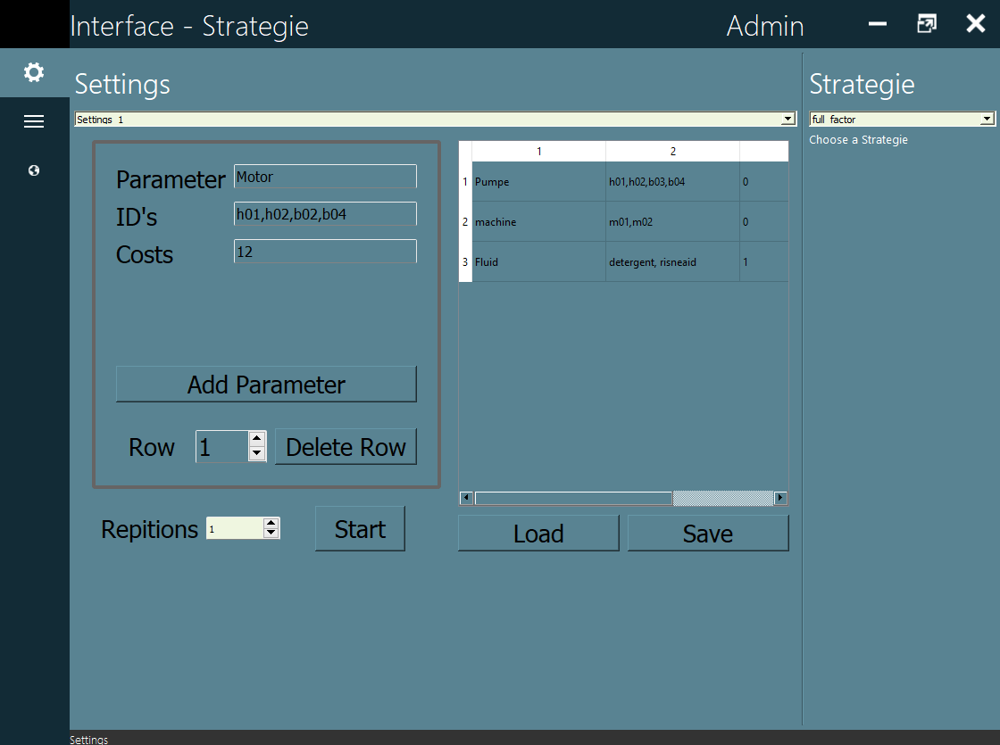
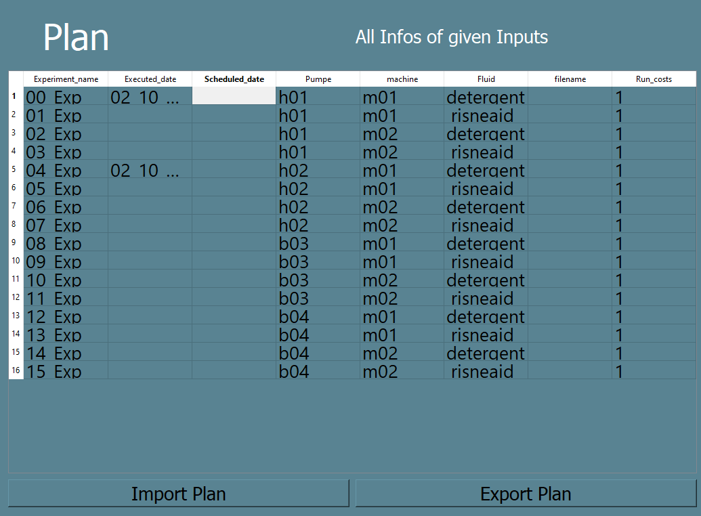
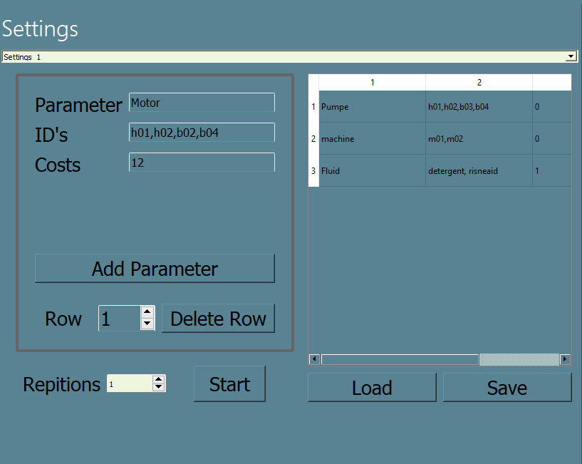
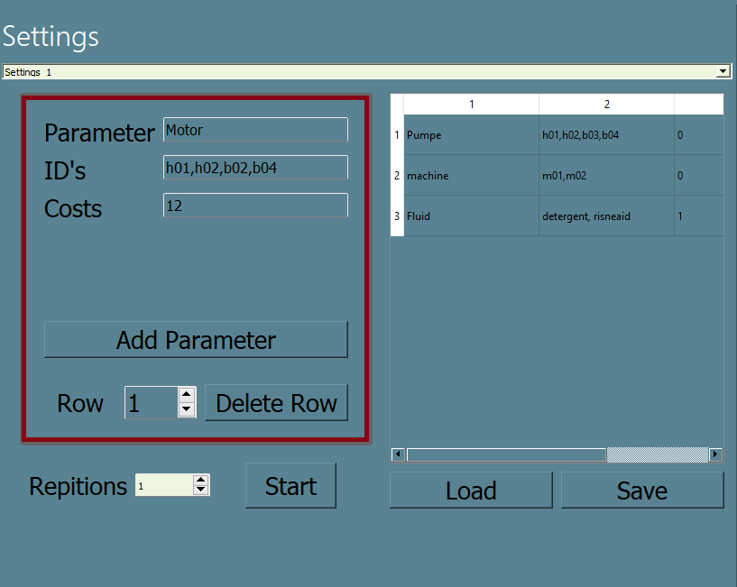
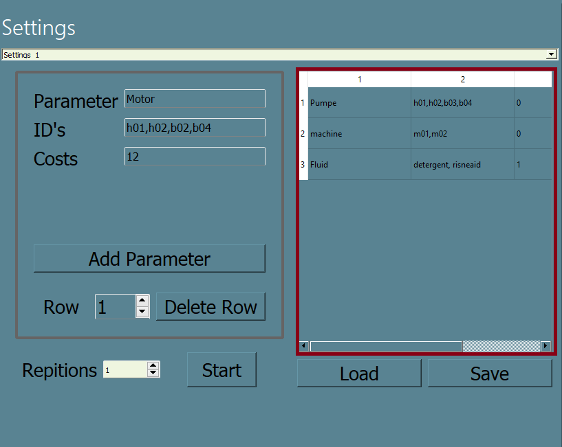
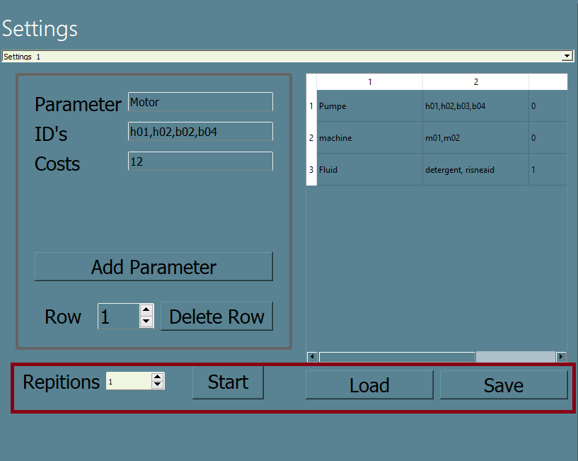
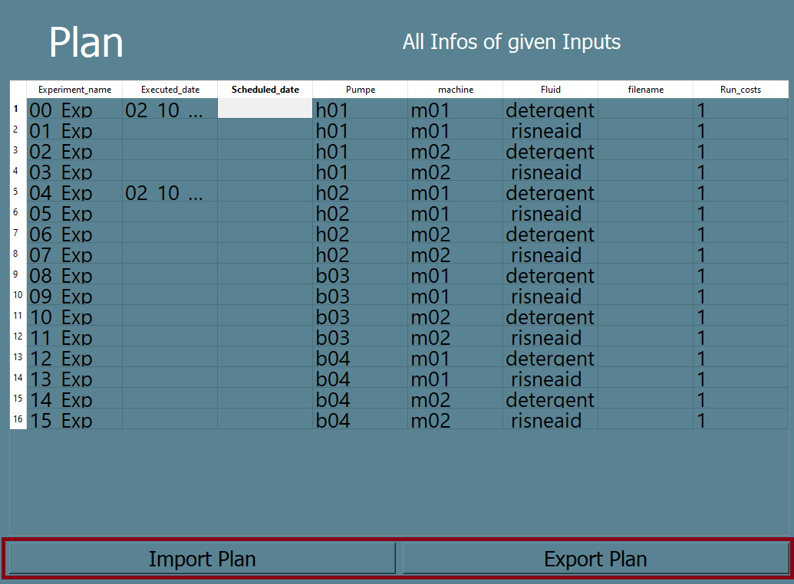

# DoE
## Description
*What it does*

## Features
- Moving the GUI by holding the left-click-button on the top/side - navigationbar
- minimizing and maximizing the GUI
- Change interface_layout in one file
- Open a Information-Tab of the current opened TAB by clicking on the ```AITAD-Logo``` at the top left
- Error-messages are handle in a seperate GUI
- etc


## Fast Start:
***
1. Start the program and this GUI will starts to appear 
### GUI


2. Create as many parameters as you want by entering data into the inputs on the left and 
pressing the ```Add Parameter```-Button. The inputs include:
   1. Parameter such as ```Motor``` or ```Machine```
   2. ID's seperated with an ```,``` each like: ```h01,h02,b03```
   3. Costs in minutes (currently unnecessary) ex.: ```20```
3. All added parameters are listed inside the table next to the input-elements, where you can change individual data afterwards

    *Deleting Parameters are possible by choosing a number starting from 1 in the spinBox and clicking on ```Delete Row``` afterwards*
4. Choose a strategie on the right side of the GUI. ex.: ```full factor```
5. Press the ```Start```-Button to generate a Plan out of the given data

*You will automatically send to another Tab called ```Plan-Tab```*

6. Make any final changes to the table before saving it by changing either 
```Executed_date```, ```Scheduled_date``` or the ```filename```. 
Everything else can only be changed later in the created file. 
7. After your done, export the currently table into an excel-file, 
which you can import again later nd continue working on.


## Navigation
***
### Top Navigation

***
#### Minimizes the GUI

#### Maximizes the GUI

#### Closes the GUI

#### Opens information/help of current tab


### Side Navigation
***
#### Navigates to Settings-Tab
 
#### Navigates to Plan-Tab
 
#### Navigates to Recordings-Tab
 

## Settings-Tab
 

In this tab you can add/remove Parameters with their coresponding ID's and costs.
The table is showing which Parameter are already set and can be saved into a file or 
loaded out of an file by clicking the buttons below the table
Repetitions are currently used for every Parameter_combination equally (always the same, not individually)

 

- ```Parameter```  - Parameter name input
- ```ID's```  - ID's seperated with ```,```
- ```Costs```  - Currently not used 
- ```Add Parameter Button```  - Adds Parameter to table (table is located on the right)
- ```Delete Row```  - Deletes specific Row on table given by the spinbox (First row = 1, 0 doesnt exist)

 

Every added Parameter is listed in this table. You can edit every cell manually
- first column is Parameter
- second column are ID's
- third column is costs

 

- ```Repetions```  - Repetitions are currently set the same for each combination (the spelling is also wrong :D)
- ```Start-Button```  - This Button starts the process of generating a Plan out of all given Parameter in the Table
- ```Load-Button```  - The Load-Button loads a previously saved parameter-table into the table
- ```Save-Button```  - The Save-Button saves the current table in a file for later use


## Plan Tab
 

This Tab shows the generated plan.
YOu can edit```Executed_date``` , ```Scheduled_date``` and ```filename``` 
everything else is only editable in the generated excel file (export)

 

By clicking on the import or export button,
a file browser opens where you can either import or export an Excel file with data


